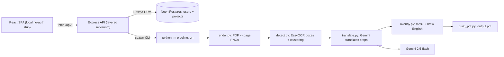
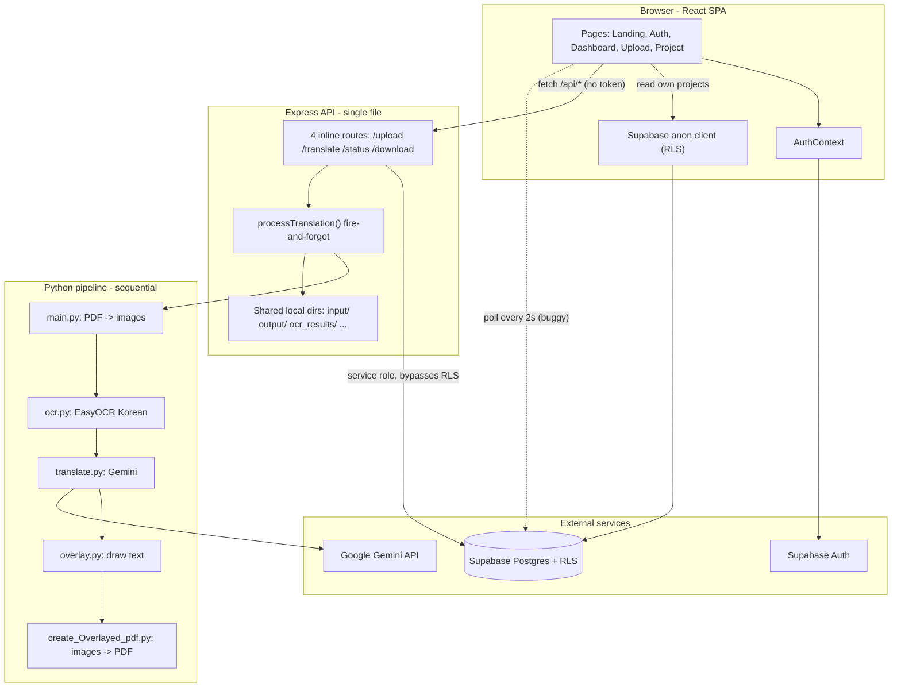
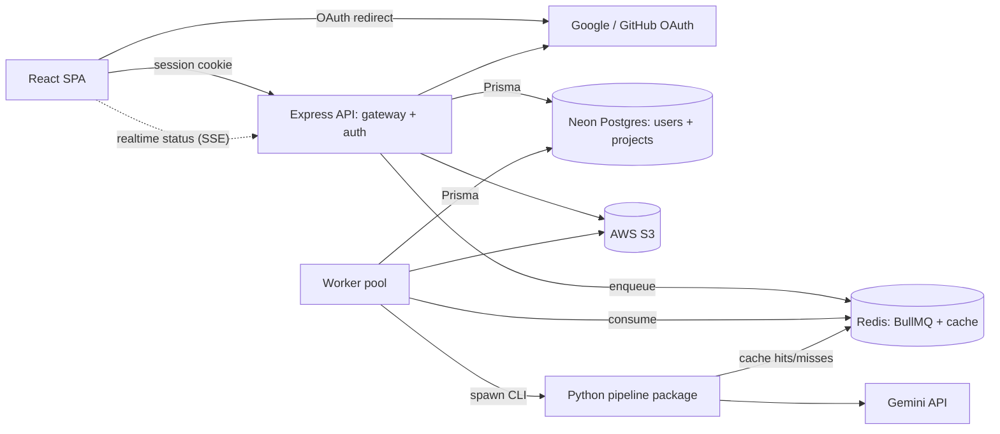

# Korinex Architecture Roadmap

Living document, updated as the project evolves. Korinex is an AI translator for
East Asian comics — **manga / manhua / manhwa** (Japanese, Chinese, Korean) —
that turns an uploaded PDF into an English-overlaid PDF.

Phases:

- **Phase 1** — make the translation pipeline actually work. **(Done)**
- **Phase 2** — move off Supabase to our own DB + OAuth stack, still free. **(In progress)**
- **Phase 3** — scale-out: job queue, caching, object storage, deploy.
- **Phase 4** — optional Kafka learning track.

## Status checklist

Phase 1 — Pipeline correctness (Done)
- [x] Render full PDF pages (`get_pixmap`, zero-padded order) — `python/pipeline/render.py`
- [x] Accurate, language-agnostic text boxes via EasyOCR CRAFT detector + line→bubble clustering — `python/pipeline/detect.py`
- [x] Gemini (`gemini-2.5-flash`) translates all region crops in one request/page; multi-language; retries + backoff — `python/pipeline/translate.py`
- [x] Bbox overlay: border-sampled background fill, contrast-aware text + outline, auto-fit/wrap, correct line-height — `python/pipeline/overlay.py`
- [x] Pipeline package + CLI (`--pdf --work-dir --project-id`); `requirements.txt`; per-job work dirs

Interim (Done)
- [x] Removed Supabase from frontend + backend
- [x] Frontend fetches via `/api/*` (Supabase client deleted); temporary no-auth local stub in `AuthContext`

Phase 2 — Own the stack (in progress)
- [x] Backend layered into `server/src/` (config, db, services, controllers, routes, middleware) + thin `index.js` bootstrap
- [x] Prisma ORM added (v6); `User` + `Project` schema; DB-backed project service replacing the JSON store; interim local user seeded on boot
- [ ] Run Prisma migration against Neon Postgres (needs `DATABASE_URL`)
- [ ] Real auth: Passport.js OAuth (Google + GitHub) + sessions in Postgres, replacing the local stub; ownership enforcement

Phase 3 — Scale-out
- [ ] Job queue (Redis + BullMQ), worker, per-job isolation; remove fire-and-forget
- [ ] Redis content-hash cache for OCR + Gemini results
- [ ] Object storage (AWS S3) with IAM least-privilege + billing alarm; signed-URL downloads
- [ ] Realtime status (SSE/websocket); fix stale-closure polling
- [ ] Dockerfiles + docker-compose; deploy (Vercel + Render/Fly + Upstash + Neon); tests + GitHub Actions CI

Phase 4 (optional)
- [ ] Emit pipeline events to Kafka + small consumer/dashboard (learning exercise, not load-bearing)

## Progress so far (as built)

- **Product scope broadened:** handles manga / manhua / manhwa; language auto-detected. UI copy updated to match.
- **Pipeline rebuilt as a hybrid** (see diagram): render pages → EasyOCR detector for accurate, language-agnostic text boxes → cluster lines into bubbles → one Gemini (`gemini-2.5-flash`) request per page translates all region crops → overlay English back into each box → rebuild PDF. Lives in `python/pipeline/` as a package with a CLI.
  - *Why hybrid:* a pure Gemini-vision pass translated well but its bounding boxes were imprecise (mislocated text / bleed). EasyOCR's CRAFT detector locates text far more accurately, so we use EasyOCR for boxes and Gemini for translation — each tool for its strength.
  - *Overlay edge cases:* samples the bubble background (border ring) so fills blend on white/black/colored panels, contrast-aware text color + outline, auto-fit + wrap, correct font line-height, transient-error retries + pacing for Gemini rate limits.
- **Supabase fully removed.** The frontend runs on a temporary no-auth local stub (`AuthContext` auto-provisions a local user). The backend has been re-layered under `server/src/` and switched to Prisma + Postgres, with an interim seeded local user until OAuth lands.
- **Known constraint:** the Gemini free-tier daily quota is easy to exhaust during heavy testing (429s). Normal single-PDF use is fine; a paid/fresh key removes the limit.

## Stack decisions

- **DB:** free managed Postgres (Neon) accessed through Prisma with our own migrations. No Supabase SDK, no servers to run, no cost.
- **Auth:** our own Express auth using Passport.js OAuth (Google + GitHub) with sessions in Postgres. (Avoiding Lucia since it is being sunset; not hand-rolling crypto.)
- **Object storage (Phase 3):** AWS S3 (chosen for resume/keyword value; 12-month free tier, an IAM least-privilege user, and a billing alarm). Code uses the standard AWS S3 SDK, so switching to R2 later is config-only.

## Plain-English glossary

Every term in this doc, in normal words.

- **API (backend).** The program between the website and the database. The website never touches the database directly; it asks the API. Think of it as the front desk of a building.
- **API gateway / "one gateway".** All requests go through that one front desk, so there's a single place to check "are you allowed to do this?"
- **Frontend / SPA.** The React website running in the browser. SPA = "single-page app": swaps content without full page reloads.
- **Backend.** Code that runs on a server, not in the browser (the Express API, the worker).
- **Database (DB) / Postgres.** Where data is permanently stored (users, projects, statuses). Postgres stores data in tables (like spreadsheets with strict columns).
- **Managed vs self-hosted DB.** Managed (Neon) = someone else runs the DB server for you, free, but you own the data. Self-hosted = you run and babysit the server yourself (cost + time). We use managed.
- **Neon.** The free service hosting our Postgres DB. Scales to zero (sleeps when unused) so it stays free.
- **ORM (Prisma).** A translator between code and the database so you write normal code instead of raw SQL. Prisma is beginner-friendly and has built-in migrations.
- **Migration.** A saved, versioned change to the database shape (e.g. "add a users table"). Like git commits, but for the DB structure.
- **Schema.** The blueprint of tables and their columns/types.
- **Auth (authentication vs authorization).** Authentication = "who are you?" (login). Authorization = "are you allowed to do this?" (is this your project?).
- **OAuth / "Sign in with Google".** A standard where Google/GitHub verifies the user and confirms their identity. You never see or store their password.
- **Passport.js.** A well-tested library that does the OAuth handshake for you, so you don't write security-critical code by hand.
- **Session / session cookie.** After login, the server remembers you via a small token in a cookie, so you don't re-login on every click. Stored in Postgres.
- **Supabase (what we left).** An all-in-one service (DB + login + security rules). Convenient but locks you in; we unbundled it so we own each piece.
- **RLS (Row-Level Security).** Supabase's rule system letting the browser read the DB directly but only its own rows. Leaving Supabase moves this job into the API.
- **Pipeline.** The assembly line: render pages → detect text boxes → translate → overlay → rebuild PDF.
- **OCR / text detection.** "Optical Character Recognition" — reading text from an image. We split it: EasyOCR's detector finds WHERE the text is (accurate boxes); Gemini reads + translates WHAT it says.
- **EasyOCR / CRAFT.** The open-source OCR library; its CRAFT detector locates text regions regardless of language. We use only its detector for accurate boxes.
- **Gemini vision.** Google's multimodal model — give it an image crop and it reads and translates the text. Strong at reading/translating, weaker at precise boxes, hence the hybrid.
- **Bounding box (bbox).** The rectangle around detected text. We remember it so we can put the English back in the same spot.
- **Overlay.** Drawing the English translation onto the image, right over where the original was.
- **Queue / job queue (BullMQ).** A waiting line for slow work. The API drops a "job" in line and answers instantly; a worker picks it up later.
- **Worker.** A separate background program that pulls jobs off the queue and runs the (slow) pipeline. Keeps the website snappy.
- **Redis.** A super-fast in-memory store. Used for the job queue and caching.
- **Cache / content-hash cache.** Remembering the answer to expensive work. We fingerprint ("hash") each page; if we've translated an identical one before, reuse it instead of paying Gemini again.
- **Fire-and-forget.** Starting translation without properly awaiting/tracking it. Fragile; the queue replaces this.
- **Per-job isolation.** Each translation gets its own private folder so concurrent jobs don't overwrite each other's files.
- **Object storage / AWS S3.** A place to store big files (PDFs, images) that isn't the database or the server's disk. Keeps workers "stateless".
- **IAM (AWS access control).** AWS's system for limited-permission keys. We make a user that can only touch our one S3 bucket.
- **Billing alarm.** An AWS budget alert (e.g. "email me if I owe more than $1") so there's never a surprise bill.
- **Signed URL.** A temporary, secret link to download a file directly from storage without making it public.
- **Polling vs SSE.** Polling = the browser repeatedly asking "done yet?". SSE ("Server-Sent Events") = the server pushes an update the moment status changes.
- **Stateless.** A program that keeps no important data on its own machine, so you can run many copies or restart freely. Key to scaling.
- **Docker / docker-compose.** Docker packages an app with everything it needs so it runs the same everywhere. docker-compose starts several pieces (api + worker + redis) together.
- **CI (GitHub Actions).** Automation that runs your tests on every push, catching breakage early.
- **Kafka.** A heavy-duty event-streaming system. Overkill here — included only as an optional thing to learn later.

## Original architecture (starting point, for history)

Where we started: a React SPA, a single-file Express API (`server/index.js`, ~246 lines), and 5 standalone Python scripts in `python/`. Supabase provided Auth + Postgres. No queue, no cache, no API auth.

Problems this addressed:

- **Broken pipeline output (Phase 1).** `main.py` extracted embedded image xrefs instead of rendering pages; `translate.py` flattened translations with `"\n".join(...)` and lost the boxes; `overlay.py` ignored boxes and stamped one line in the center.
- **Supabase lock-in (Phase 2).** Auth, DB, and RLS all came from Supabase; the frontend read the DB directly.
- **No real API security (Phase 2).** `/api/*` calls carried no token; the API trusted `userId` from the request body.
- **No concurrency safety (Phase 3).** Fire-and-forget in-process runs sharing folders and a hardcoded output filename.
- **Buggy status polling (Phase 3).** A stale-closure interval that might never stop.

## Engineering decisions (the "why")

- **Correct before fast.** A broken pipeline is not worth scaling, so pipeline accuracy was Phase 1.
- **Own the stack without paying.** Neon (free managed Postgres) + our own ORM/migrations gives ownership with zero servers to run. Truly self-hosting Postgres would add cost, backups, and patching.
- **Don't hand-roll auth.** Passport.js OAuth + sessions in Postgres gives auth we fully control without writing crypto from scratch.
- **One gateway.** Leaving Supabase removes RLS, so the API becomes the single place that authenticates users and enforces ownership.
- **Job queue, not Kafka.** The workload is "a few expensive batch jobs," not a high-volume event stream. BullMQ on Redis fits; Python stays a CLI invoked by the worker. Kafka is a Phase 4 learning track.
- **One Redis, two jobs.** The same free Redis backs both the queue and a content-hash cache, so identical pages never re-pay Gemini.
- **Free-tier only:** Neon (DB), Upstash (Redis), AWS S3 (storage, free tier), Vercel/Netlify (frontend), Render/Fly (api + worker).

## Target architecture (end state, Phase 3 complete)

## Phase details

### Phase 1 — Pipeline correctness (Done)

Implemented in `python/pipeline/` (`render.py`, `detect.py`, `translate.py`, `overlay.py`, `build_pdf.py`, `run.py`, `config.py`). See the status checklist above. Possible future polish (not blocking): filter tiny/low-confidence detections so watermarks/SFX aren't translated; handle very tall webtoon strips; consider an image-editing model for professional in-place typesetting.

### Phase 2 — Own the stack (in progress)

Done so far: Supabase removed; frontend fetches via `/api/*` on a temporary no-auth stub; backend re-layered under `server/src/`; Prisma + `User`/`Project` schema; DB-backed project service; interim local user seeded on boot.

Remaining:

- **Data layer.** Provision Neon Postgres, set `DATABASE_URL` in `server/.env`, run `npx prisma migrate dev --name init`.
- **Own auth.** Passport.js Google + GitHub strategies, sessions in Postgres (`connect-pg-simple`), replace the local stub in `AuthContext`; middleware attaches `req.user`; enforce project ownership.

### Phase 3 — Scale-out

- Job queue + per-job isolation (Redis + BullMQ + worker), removing fire-and-forget.
- Redis content-hash cache for OCR + translation results.
- Object storage on AWS S3 (IAM least-privilege, billing alarm); signed-URL downloads; stateless workers.
- Realtime status via SSE; fix the polling bug.
- Dockerfiles + docker-compose; deploy (Vercel + Render/Fly + Upstash + Neon); tests + GitHub Actions CI.

### Phase 4 — Optional Kafka learning track

Emit pipeline events (`page.ocr.done`, `page.translated`) to Kafka and build a small consumer/dashboard, purely to learn event streaming. Not load-bearing.

## Next steps

Finish Phase 2: set `DATABASE_URL` and run the migration, then add Passport OAuth to replace the local stub. After that, Phase 3 (queue, cache, S3, deploy). Accounts needed along the way: Neon (DB), Upstash (Redis), AWS (S3).
